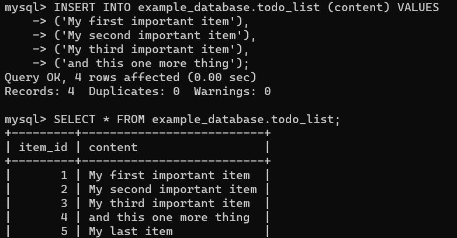

# Project 2 Documentation

# Installing the nginx web server

`sudo apt install nginx`

# Installing mysql

`sudo apt install mysql-server`

# Installing PHP

`sudo apt install php-fpm php-mysql`

# Configuring nginx to use php processor

`sudo ln -s /etc/nginx/sites-available/projectLEMP /etc/nginx/sites-enabled/`

# Testing PHP with Nginx

`sudo nano /var/www/projectLEMP/info.php`

# Retrieving data from MySQL database with PHP

`mysql> CREATE DATABASE `example_database`;`

# To confirm that the data was successfully saved to table

`mysql>   SELECT * FROM example_database.todo_list;`

# Creating a PHP script that will connect to MySQL

`nano /var/www/projectLEMP/todo_list.php`

# PHP environment is ready to connect with MySQL server

`http://34.229.78.131/todo_list.php`

